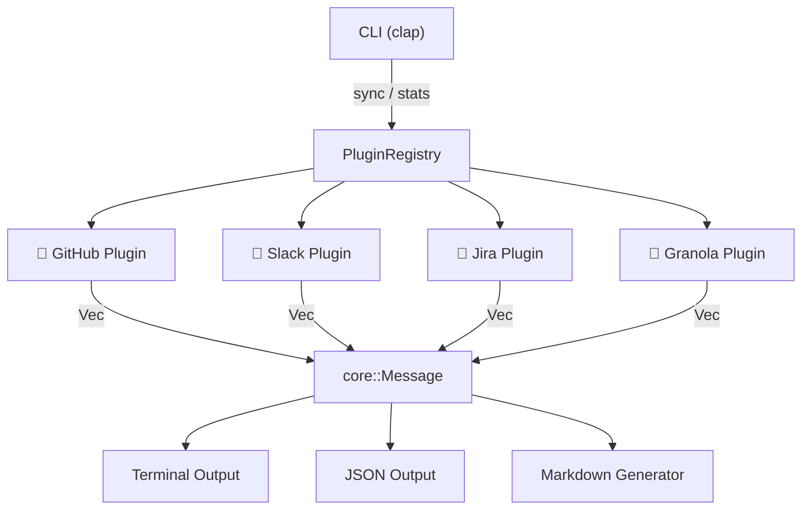
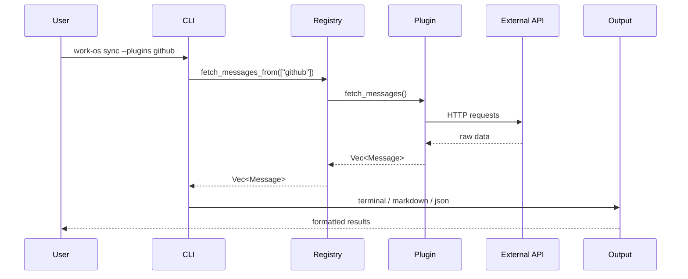

# Architecture

Work-OS is built around a plugin registry that collects `Message` items from multiple sources, then feeds them into output generators.

## System Overview



## Core Concepts

### `Message`

Everything in Work-OS becomes a `Message`. It is the single unified model passed between plugins and output generators:

```
Message {
  id          — unique key: "source:type:id"
  source      — "github" | "slack" | "jira" | "granola"
  message_type — PullRequest | Issue | Review | Message | Ticket | Statistics | MOM
  title
  description
  url
  priority    — Critical | High | Medium | Low | Unknown
  status      — Open | InProgress | Blocked | Done
  created_at / updated_at
  people      — Vec<Person> with roles (Author, Assignee, Reviewer, Mentioned)
  metadata    — MessageMetadata::GitHub(...) | None
}
```

### Plugin Trait

Every plugin implements:

```rust
#[async_trait]
pub trait Plugin: Send + Sync {
    fn metadata(&self) -> PluginMetadata;
    fn is_configured(&self) -> bool;
    fn config_schema(&self) -> Vec<ConfigField>;
    fn configure_from_values(&mut self, values, base_path) -> Result<()>;
    async fn test_connection(&self) -> Result<bool>;
    async fn fetch_messages(&self) -> Result<Vec<Message>>;
}
```

### DateRange

All fetching is scoped to a `DateRange` stored as a global singleton after initialization. Run modes:

| Mode | Description |
|------|-------------|
| `today` | Midnight → now |
| `since-last-run` | Last saved run time → now |
| `weekend` | Previous Friday → now |
| `days-N` | N days ago → now |
| `--from / --to` | Custom date range |

## Data Flow



## Directory Structure

```
src/
├── main.rs               — CLI entry point (clap)
├── cli/
│   ├── sync.rs           — sync command
│   ├── stats.rs          — stats command
│   ├── config.rs         — config command
│   └── auth.rs           — auth test command
├── core/
│   ├── message.rs        — Message, MessageType, MessageMetadata, etc.
│   ├── plugin.rs         — Plugin trait + ConfigField schema
│   └── registry.rs       — PluginRegistry
├── generators/
│   └── markdown.rs       — Markdown file generator
├── models/
│   ├── config.rs         — WorkOsConfig (TOML)
│   ├── date_range.rs     — DateRange + RunMode
│   └── state.rs          — WorkOsState (last run tracking)
└── plugins/
    ├── github/           — GitHub plugin
    ├── slack/            — Slack plugin
    ├── jira/             — Jira plugin
    └── granola/          — Granola plugin
```

## Configuration Storage

Config is stored in TOML at `~/.config/work-os/config.toml`. Each plugin has an `[plugins.name]` section with `enabled = true/false` and a `values` table.

State (last run timestamps, etc.) is stored at `~/.config/work-os/state.json`.
