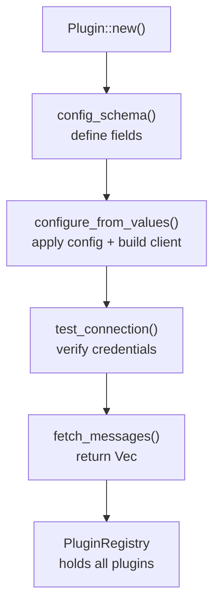

# Building a Plugin

Every integration in Work-OS is a plugin that implements the `Plugin` trait and converts raw API data into `Message` items.

## Plugin Lifecycle



## Step 1 — Create the plugin directory

```
src/plugins/myservice/
├── mod.rs          ← Plugin trait impl + config schema
├── client.rs       ← API calls, returns Vec<Message>
├── model.rs        ← API response structs (serde)
└── config.rs       ← MyServiceConfig struct (optional)
```

## Step 2 — Define your config

```rust
// src/plugins/myservice/config.rs
pub struct MyServiceConfig {
    pub api_key: String,
}
```

## Step 3 — Implement the client

```rust
// src/plugins/myservice/client.rs
use crate::core::message::{Message, MessageType};
use crate::error::Result;

pub struct MyServiceClient {
    api_key: String,
}

impl MyServiceClient {
    pub fn new(config: &MyServiceConfig) -> Result<Self> {
        Ok(Self { api_key: config.api_key.clone() })
    }

    pub async fn get_all_messages(&self) -> Result<Vec<Message>> {
        // call your API, map results to Message
        let items = self.fetch_items().await?;
        Ok(items.into_iter().map(|i| self.to_message(i)).collect())
    }

    fn to_message(&self, item: ApiItem) -> Message {
        Message::new("myservice", MessageType::Other("item".into()), &item.id, item.title, item.url)
            .with_date(item.created_at, item.updated_at)
            .with_priority(Priority::Medium)
    }
}
```

## Step 4 — Implement the Plugin trait

```rust
// src/plugins/myservice/mod.rs
use crate::core::plugin::{ConfigField, ConfigFieldType, Plugin, PluginMetadata};
use crate::core::message::Message;

pub struct MyServicePlugin {
    client: Option<MyServiceClient>,
    config: Option<MyServiceConfig>,
}

#[async_trait]
impl Plugin for MyServicePlugin {
    fn metadata(&self) -> PluginMetadata {
        PluginMetadata {
            id: "myservice",
            name: "My Service",
            description: "Fetch items from My Service",
            icon: "🔌",
        }
    }

    fn config_schema(&self) -> Vec<ConfigField> {
        vec![
            ConfigField {
                name: "api_key",
                label: "API Key",
                help: "Your My Service API key",
                field_type: ConfigFieldType::Secret,
                required: true,
                default: None,
            },
        ]
    }

    fn configure_from_values(&mut self, values: &HashMap<String, Value>, _: &PathBuf) -> Result<()> {
        let api_key = values.get("api_key")
            .and_then(|v| v.as_str())
            .ok_or_else(|| WorkOsError::Config("api_key required".into()))?
            .to_string();

        let config = MyServiceConfig { api_key };
        self.client = Some(MyServiceClient::new(&config)?);
        self.config = Some(config);
        Ok(())
    }

    async fn fetch_messages(&self) -> Result<Vec<Message>> {
        match &self.client {
            Some(client) => client.get_all_messages().await,
            None => Ok(Vec::new()),
        }
    }

    // ... other required methods
}
```

## Step 5 — Register the plugin

In `src/plugins/mod.rs`, add your plugin to `create_registry`:

```rust
pub mod myservice;
use crate::plugins::myservice::MyServicePlugin;

pub fn create_registry(config: &WorkOsConfig) -> Result<PluginRegistry> {
    // ... existing plugins ...

    let mut my_plugin = MyServicePlugin::new();
    if let Some(cfg) = config.get_plugin("myservice") {
        if cfg.enabled {
            let _ = my_plugin.configure_from_values(&cfg.values, &output_path);
        }
    }
    registry.register(Box::new(my_plugin));

    Ok(registry)
}
```

## Message Type Reference

Pick the `MessageType` that best fits your data:

| Type | Use for |
|------|---------|
| `PullRequest` | Code review requests |
| `Issue` | Bug reports |
| `Review` | Code reviews |
| `Message` | Chat / notifications |
| `Ticket` | Task / story / work item |
| `Statistics` | Aggregated stats summaries |
| `MOM` | Meeting notes |
| `Other(String)` | Anything else |

## Tips

- Scope all API calls to `DateRange::get()` so the plugin respects `--mode` and `--from/--to`
- Return an empty `Vec` (not an error) when the plugin is unconfigured
- Use `Message::format_absolute_time()` for any timestamps you include in descriptions
- Keep `client.rs` focused on API calls; put business logic in helpers
