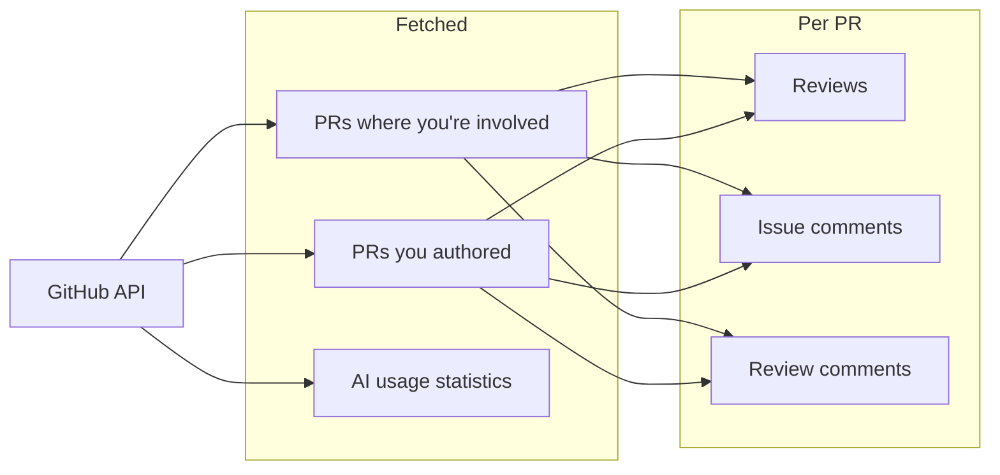
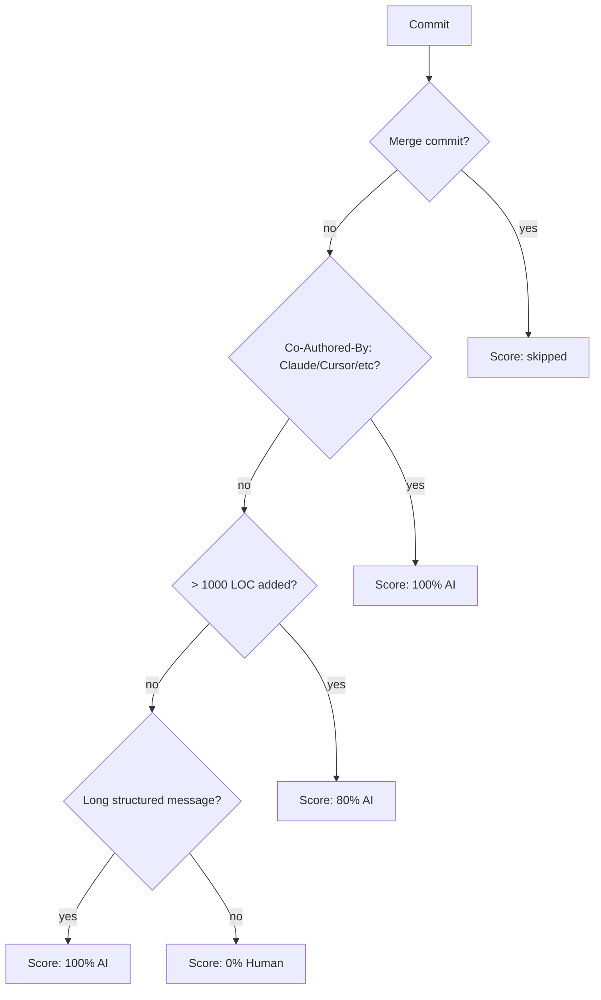

# GitHub Plugin

Fetches pull requests, reviews, and comments from GitHub, plus AI usage statistics based on commit analysis.

## Setup

```bash
work-os config set github token YOUR_GITHUB_TOKEN
work-os config set github username YOUR_GITHUB_USERNAME

# Optional: limit to specific orgs or repos
work-os config set github include_orgs myorg,anotherorg
work-os config set github include_repos owner/repo1,owner/repo2

# Optional: ignore bot accounts
work-os config set github bots dependabot[bot],renovate[bot]
```

Create a Personal Access Token at: https://github.com/settings/tokens

## Permissions

Work-OS uses a classic PAT. The required scopes are:

| Scope | Why it's needed |
|-------|----------------|
| `repo` | Read PRs, commits, and issue comments from your repositories |
| `read:org` | Read organisation membership — required to fetch PRs from org repos |
| `read:user` | Read your user profile — used to identify PRs you authored |

If you're using a **fine-grained PAT** (PAT v2) instead, the equivalent repository permissions are:
- Pull requests: Read
- Contents: Read
- Metadata: Read (required by default)
- Members (organisation): Read

> If you only care about your own repos (not an org), you can skip `read:org`.

## What It Fetches



| Message type | Source |
|---|---|
| `PullRequest` | PRs you authored or are involved in |
| `Statistics` | AI code usage summary across all PRs |

## AI Usage Statistics

The plugin analyses every commit in your PRs to estimate how much code was AI-assisted:



Merge commits are excluded from all LOC totals and scoring.

**Signals detected:**

| Signal | Description | AI Score |
|--------|-------------|----------|
| `ExplicitAttribution` | `Co-Authored-By: Claude` in message | 100% |
| `LargeBurst` | >1000 LOC added in a single commit | 80% |
| `LongDescriptive` | Multi-line structured commit message | 100% |
| `ShortSimple` | Single-line, terse commit message | 0% |
| `MergeCommit` | Merge commit — skipped entirely | — |

## Configuration Reference

| Key | Required | Description |
|-----|----------|-------------|
| `token` | ✅ | GitHub Personal Access Token |
| `username` | ✅ | Your GitHub username |
| `include_orgs` | — | Comma-separated org names to filter |
| `include_repos` | — | Comma-separated `owner/repo` to filter |
| `bots` | — | Bot usernames to exclude from reviews/comments |

## CLI Usage

```bash
# Sync GitHub only
work-os sync --plugins github

# AI code stats for today
work-os stats --type ai-code

# AI stats for the past week
work-os stats --type ai-code --mode days-7
```
