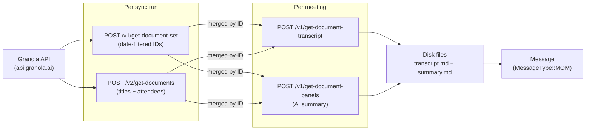

# Granola Plugin

Fetches meeting notes and transcripts from Granola via its live HTTP API. No API token configuration needed — authentication is handled automatically using a token that Granola stores locally on your machine.

> **macOS only** — Granola is a macOS app. The auth token it writes to disk is required for API access.

## Setup

```bash
work-os config init granola
# No credentials to enter — just enable the plugin
```

Granola must be installed and you must have signed in at least once. The plugin reads your auth token directly from Granola's local storage.

## Permissions

No manual token setup required. The plugin reads a WorkOS access token from a file Granola maintains automatically:

| What's accessed | Path |
|----------------|------|
| Granola auth token | `~/Library/Application Support/Granola/supabase.json` |
| Meeting output folder | `{output.base_path}/{output.markdown_path}/{date}/moms/` |

> **If you're getting empty results or auth errors:** Granola may have refreshed your session. Open the Granola app and make sure you're signed in, then retry.
>
> **Note:** `work-os auth granola` checks that the token file is readable — it does not verify the token against the API. A successful auth check does not guarantee meetings will sync.

## What It Fetches



### API calls made

| Endpoint | Purpose |
|----------|---------|
| `POST /v1/get-document-set` | Get document IDs within the current date range |
| `POST /v2/get-documents` | Get full metadata (title, attendees) for all documents |
| `POST /v1/get-document-transcript` | Get transcript segments for one meeting |
| `POST /v1/get-document-panels` | Get AI-generated summary panels for one meeting |

The first two run once per sync. The last two run once per meeting.

### Date filtering

Date filtering works in two stages:
1. `get-document-set` returns IDs filtered by `start`/`end` timestamps
2. `get-documents` returns all documents with no date filter
3. The plugin merges the two by document ID and applies a final `created_at` check — only meetings where `created_at` falls inside the `DateRange` are kept

## What It Produces

### Message fields

| Field | Value |
|-------|-------|
| `source` | `"granola"` |
| `message_type` | `MOM` |
| `title` | Meeting title |
| `url` | `file:///` path to the meeting folder on disk |
| `description` | Full content of `summary.md` |
| `created_at` | Meeting creation time from API |
| `updated_at` | Meeting update time from API |

> Attendees are written into the disk files but are not included in `Message.people`.

### Disk output

For each meeting, two files are written to:

```
{output.base_path}/{output.markdown_path}/{YYYY-MM-DD}/moms/{meeting-title}/
    transcript.md
    summary.md
```

**`transcript.md`** — raw meeting transcript with speaker labels:
```markdown
# Weekly Sync

Date: 2026-02-28
Attendees: person@company.com, other@company.com

**You (microphone)**: Let's start with the PR review queue.
**Other (system audio)**: Sure, I've got three open for review.
```

Only final transcript segments are included (`is_final == true`). In-progress segments are skipped.

**`summary.md`** — AI-generated summary from Granola's panels:
```markdown
Date: 2026-02-28
Attendees: person@company.com, other@company.com

## Key Decisions
- Agreed to ship the feature behind a flag

## Action Items
- [ ] Person A: Update the ERD by Thursday
- [ ] Person B: Start implementation Monday
```

If Granola didn't generate a summary for a meeting, `summary.md` contains: `*No AI summary was generated for this meeting.*`

### Title sanitisation

Meeting folder names are derived from the title:
- Spaces → `-`
- Alphanumeric, `-`, `_` → kept as-is
- Everything else → `_`

Example: `"SP View — ERD & Dev Start"` → `SP-View-_-ERD-_-Dev-Start`

## Configuration Reference

| Key | Required | Description |
|-----|----------|-------------|
| `enabled` | ✅ | `true` / `false` |

No other fields. The auth token is read automatically. The output path comes from `[output]` config.

```toml
[plugins.granola]
enabled = true
```

## CLI Usage

```bash
# Sync meeting notes only
work-os sync --plugins granola

# Include in full sync
work-os sync

# Combine with Slack for full context (async messages + meeting notes)
work-os sync --plugins granola,slack
```

## How It Appears in Sync Files

Granola meetings appear as `🎤 [GRANOLA]` entries:

```
🎤 [GRANOLA] Weekly Team Sync
    Date: 2026-02-28
    Attendees: person@company.com, other@company.com

    ## Key Decisions
    - Agreed on single-table approach for vendor data model

    ## Action Items
    - [ ] Owner A: Finalise ERD by Thursday
    - [ ] Owner B: Start implementation Monday

    file:///path/to/moms/Weekly-Team-Sync/
```

The `work-os-today` command handles two formats:

| Format | Source | Notes |
|--------|--------|-------|
| `🎤 [GRANOLA]` entries | Direct from plugin | Structured, includes file link and attendees |
| Meeting notes pasted into Slack | Someone shared notes manually | Freeform, parsed semantically |

Both are extracted for action items. Direct sync is preferred — it includes the full transcript link and structured metadata.

## Limitations

- **macOS only** — no Linux or Windows support
- **Requires Granola to be installed** and signed in
- **Token file is fixed** — `~/Library/Application Support/Granola/supabase.json`. Cannot be overridden in config.
- **`work-os auth granola` only checks file readability** — does not verify the token against the API. A passing auth check does not guarantee meetings will sync.
- **Experimental** — Granola's API is undocumented and may change between app versions without notice. If meetings stop appearing after a Granola update, open an issue.
- **Transcript segments marked `is_final == false` are skipped** — live/in-progress segments from incomplete meetings are excluded.
- **Attendees are not in `Message.people`** — they appear in the disk files only, not in the unified `Message` model.
