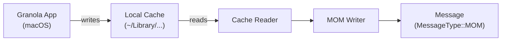

# Granola Plugin

Reads meeting notes and transcripts from Granola's local cache. No API token needed — it reads directly from the app's local storage.

> **macOS only** — Granola is a macOS app and its cache lives at a fixed path on disk.

## Setup

```bash
work-os config init granola
# No credentials required — just enable the plugin
```

Granola must be installed and have run at least once to populate its cache.

## Permissions

No API tokens or OAuth scopes needed. The plugin reads directly from the filesystem.

| What's accessed | Path |
|----------------|------|
| Granola local cache | `~/Library/Application Support/Granola/` |

This is inside your own user Library, so no special macOS permissions are required. If Granola is installed and has recorded at least one meeting, it will work.

The only thing that can block it: if macOS Full Disk Access is not granted to your terminal emulator and Granola's cache lives in a restricted location. In practice this hasn't been an issue, but if you're getting empty results, check System Settings > Privacy & Security > Full Disk Access.

## How It Works



The plugin:
1. Reads Granola's local JSON cache from `~/Library/Application Support/Granola/`
2. Parses meeting records (title, transcript, summary, attendees, date)
3. Converts each meeting into a `Message` with `MessageType::MOM` (Minutes of Meeting)
4. Filters to only meetings within the current `DateRange`

## What It Produces

| Field | Value |
|-------|-------|
| `message_type` | `MOM` |
| `title` | Meeting title |
| `description` | Formatted notes / summary |
| `created_at` | Meeting date/time |
| `people` | Attendees as `Person` entries |
| `url` | Empty (local only) |

## Configuration Reference

| Key | Required | Description |
|-----|----------|-------------|
| *(none)* | — | No configuration fields needed |

The only setting is `enabled = true/false` in your config.

## CLI Usage

```bash
# Sync meeting notes only
work-os sync --plugins granola

# Include in full sync
work-os sync
```

## Limitations

- macOS only
- Requires Granola app to be installed
- Cache path is fixed — cannot be customised
- Experimental: Granola's cache format may change between app versions
