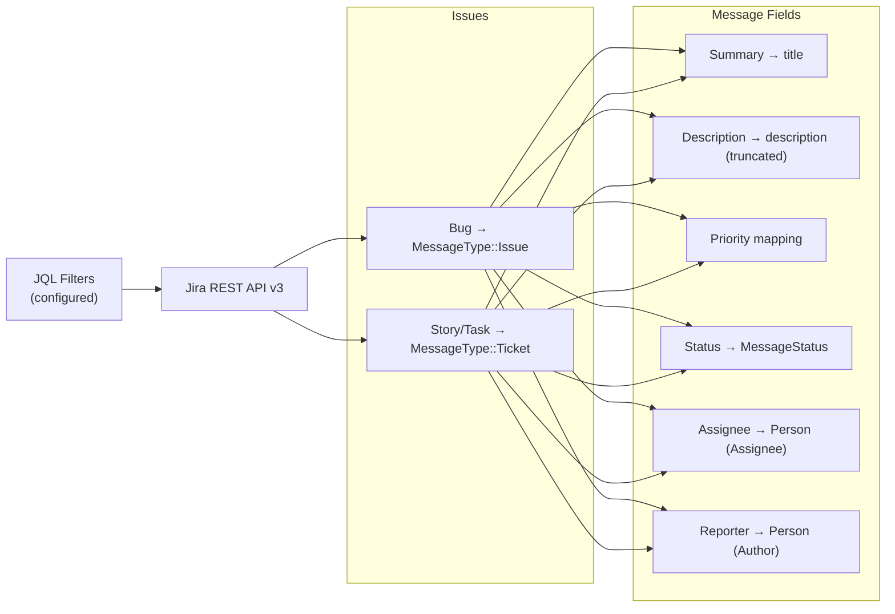

# Jira Plugin

Fetches issues from Jira/Atlassian using configurable JQL filters.

## Setup

```bash
work-os config set jira domain company.atlassian.net
work-os config set jira email your-email@company.com
work-os config set jira token YOUR_API_TOKEN
```

Create an API token at: https://id.atlassian.com/manage-profile/security/api-tokens

## Permissions

Jira API tokens don't have granular scopes — they inherit whatever your Atlassian account can access. What matters is that your account has the right project-level permissions in Jira itself.

**What your account needs in each project you query:**

| Permission | Why it's needed |
|------------|----------------|
| Browse Projects | See the project and its issues at all |
| View Issues | Read issue fields (summary, description, status, assignee) |

If a JQL filter returns no results and you expect it to, the most likely cause is that your account doesn't have Browse Projects permission on that project.

**There are no additional OAuth scopes to configure** — the API token is used with Basic Auth (email + token). All access is determined by your Jira project memberships.

## Filters

The Jira plugin is driven entirely by JQL filters you define. Each filter has a name, a JQL query, and a priority level.

```bash
work-os config init jira
# → walks you through adding filters interactively
```

**Example filters:**

```toml
[[plugins.jira.values.filters]]
name = "My Active Tickets"
jql = "project = EM AND assignee = currentUser() AND status != Done"
priority = "high"

[[plugins.jira.values.filters]]
name = "Needs Review"
jql = "project = EM AND status = 'In Review'"
priority = "medium"
```

## What It Fetches



## Priority Mapping

| Jira Priority | Work-OS Priority |
|---------------|-----------------|
| Highest / P0 | `Critical` |
| High / P1 | `High` |
| Medium / P2 | `Medium` |
| Low / P3–P4 | `Low` |
| *(filter default)* | Configurable per filter |

## Status Mapping

Jira status categories are mapped as follows:

| Jira Category | MessageStatus |
|---------------|--------------|
| `new` (To Do) | `Open` |
| `indeterminate` (In Progress) | `InProgress` |
| `done` | `Done` |
| other | `Open` |

## Configuration Reference

| Key | Required | Description |
|-----|----------|-------------|
| `domain` | ✅ | Atlassian domain (e.g. `company.atlassian.net`) |
| `email` | ✅ | Email for Basic Auth |
| `token` | ✅ | Atlassian API token |
| `filters` | — | Array of `{ name, jql, priority }` |

## CLI Usage

```bash
# Sync Jira only
work-os sync --plugins jira

# Full sync including Jira
work-os sync --plugins github,jira,slack
```
